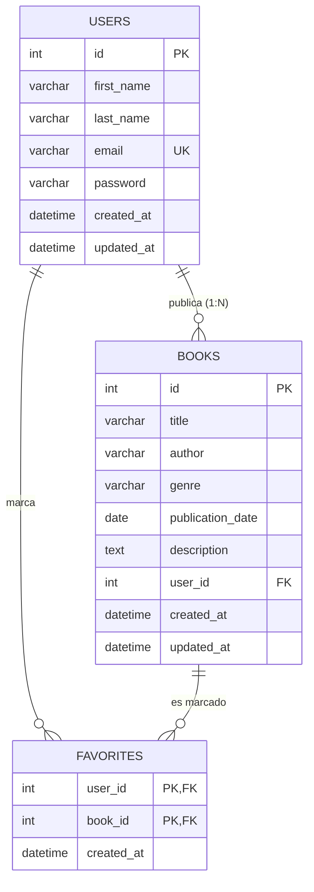

# ERD - BookHub

- **users 1:N books**: un usuario publica muchos libros.
- **users N:M books** (vía `favorites`): un usuario tiene muchos libros favoritos y un libro es favorito de muchos usuarios.
